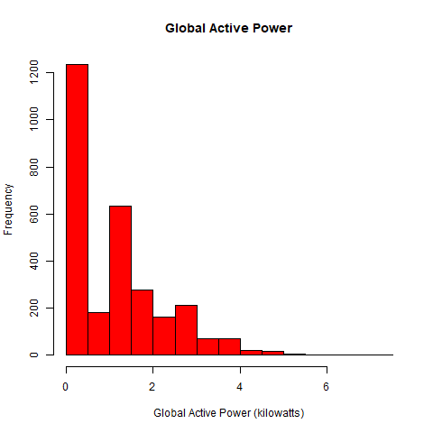
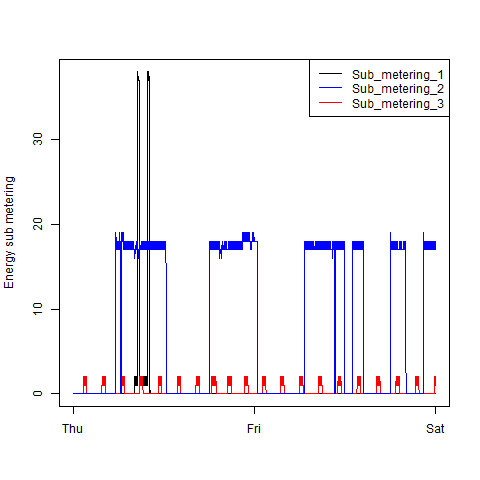
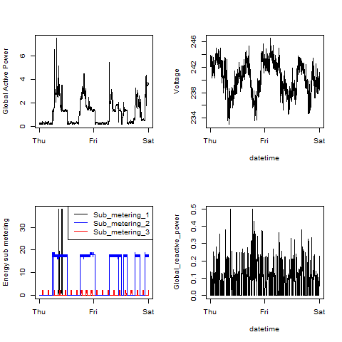

## Introduction

*Note:* This section is identical to the original forked from the following GitHub repository:
[https://github.com/rdpeng/ExData_Plotting1](https://github.com/rdpeng/ExData_Plotting1)

This assignment uses data from
the <a href="http://archive.ics.uci.edu/ml/">UC Irvine Machine
Learning Repository</a>, a popular repository for machine learning
datasets. In particular, we will be using the "Individual household
electric power consumption Data Set" which I have made available on
the course web site:

* <b>Dataset</b>: <a href="https://d396qusza40orc.cloudfront.net/exdata%2Fdata%2Fhousehold_power_consumption.zip">Electric power consumption</a> [20Mb]

* <b>Description</b>: Measurements of electric power consumption in
one household with a one-minute sampling rate over a period of almost
4 years. Different electrical quantities and some sub-metering values
are available.

The following descriptions of the 9 variables in the dataset are taken
from
the <a href="https://archive.ics.uci.edu/ml/datasets/Individual+household+electric+power+consumption">UCI
web site</a>:

<ol>
<li><b>Date</b>: Date in format dd/mm/yyyy </li>
<li><b>Time</b>: time in format hh:mm:ss </li>
<li><b>Global_active_power</b>: household global minute-averaged active power (in kilowatt) </li>
<li><b>Global_reactive_power</b>: household global minute-averaged reactive power (in kilowatt) </li>
<li><b>Voltage</b>: minute-averaged voltage (in volt) </li>
<li><b>Global_intensity</b>: household global minute-averaged current intensity (in ampere) </li>
<li><b>Sub_metering_1</b>: energy sub-metering No. 1 (in watt-hour of active energy). It corresponds to the kitchen, containing mainly a dishwasher, an oven and a microwave (hot plates are not electric but gas powered). </li>
<li><b>Sub_metering_2</b>: energy sub-metering No. 2 (in watt-hour of active energy). It corresponds to the laundry room, containing a washing-machine, a tumble-drier, a refrigerator and a light. </li>
<li><b>Sub_metering_3</b>: energy sub-metering No. 3 (in watt-hour of active energy). It corresponds to an electric water-heater and an air-conditioner.</li>
</ol>

## Loading the data

There is a single script, called get_household_power_consumption_data.R that does the following:

* Checks for the zip file with the source data in the local hard drive

* If the zip file is not found, it downloads it

* Gets the data for the two days (2007-02-01 and 2007-02-02) to plot and it saves it as a csv in the local hard drive

* It formats the Date variable with the `as.Date()` function.

* It sets the missing values coded as `?` to `NA` instead.

## Making Plots

There is one script for generating each of the plots:

* The scripts are named `plot<#>.R`, where `<#>` is a value from 1-4

* The device used is png in all four cases, with the default values for `width = 480, height = 480, units = "px"`

* The four plots are saved under the "data" folder with file name `plot<#>.png`, where `<#>` is a value from 1-4

* Each script checks for the data file.  If the data is not found, the script that downloads the file is invoked.  This ensures that all four plotting scripts re-use the logic to download the file.  If that logic ever has to change, such as to reflect a URL change, only one script has to be modified and not all four of them

### Plot 1

 

### Plot 2

 

### Plot 3

 

### Plot 4

 

